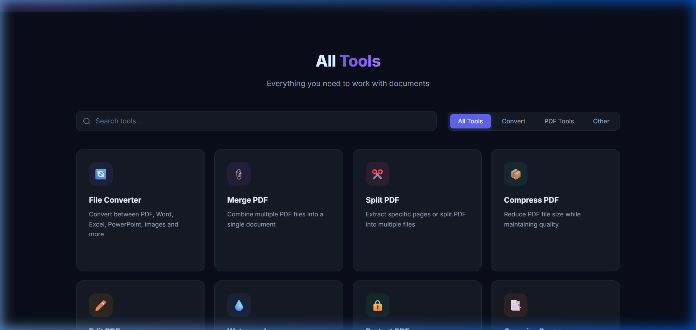
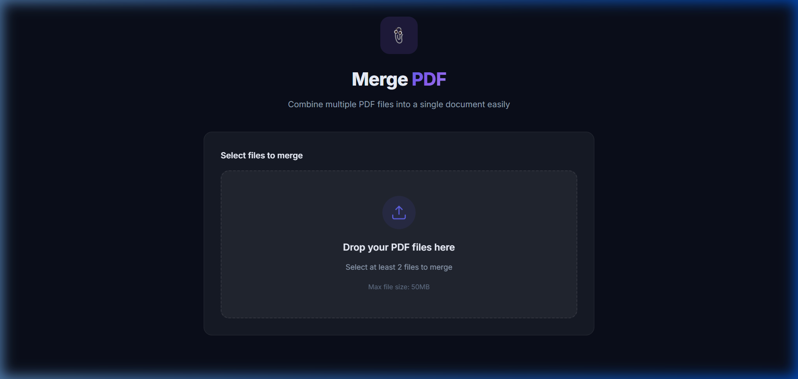

# 📑 PDF Master - All-in-One PDF Tools



A professional, full-stack web application for all your PDF needs. Built with a modern, glassmorphic UI and a robust Node.js backend.

## 🌟 Features

- **🔄 File Converter**: Swap between PDF, Word, Excel, PowerPoint, and Images seamlessly.
- **📎 Merge & Split**: Combine multiple PDFs or extract specific pages.
- **📦 Compress**: Reduce file size while maintaining quality.
- **✏️ Edit PDF**: Add text, annotations, and branding directly to your documents.
- **🛡️ Password Protect**: Secure your files with industrial-grade AES-256 encryption.
- **📑 Organize**: Reorder, rotate, or delete pages with a simple drag-and-drop interface.
- **🌐 Translate**: Translate PDF content into 11+ languages automatically.
- **📈 History & Stats**: Track your operations and data processed in a sleek dashboard.

## 📸 Screenshots

### Home Page


### Merge Tool


## 🚀 Quality & Tech Stack

- **Frontend**: Angular 17+ (Standalone Components, Signals, Modern Routing)
- **Backend**: Node.js & Express.js
- **Database**: MongoDB (History Tracking)
- **PDF Core**: `pdf-lib`, `qpdf-wasm` (Standard Encryption), `sharp` (Image Processing)
- **Design**: Premium Glassmorphism, CSS Variables, Responsive Layouts

## 🛠️ Local Installation

### Prerequisites
- [Node.js](https://nodejs.org/) (v18+)
- [MongoDB](https://www.mongodb.com/) (Local or Atlas)

### Setup
1. Clone the repository:
   ```bash
   git clone https://github.com/Hemil-Gandhi/PDFConverter.git
   cd PDFConverter
   ```

2. Install and start the **Backend**:
   ```bash
   cd server
   npm install
   npm start
   ```

3. Install and start the **Frontend**:
   ```bash
   cd ../client
   npm install
   npm start
   ```

## 🌐 Deployment

The project is pre-configured for deployment:
- **Frontend**: Vercel (see `client/vercel.json`)
- **Backend**: Render (Standard Node.js service)
- **Database**: MongoDB Atlas

## 📄 License
MIT License - Feel free to use and contribute!
